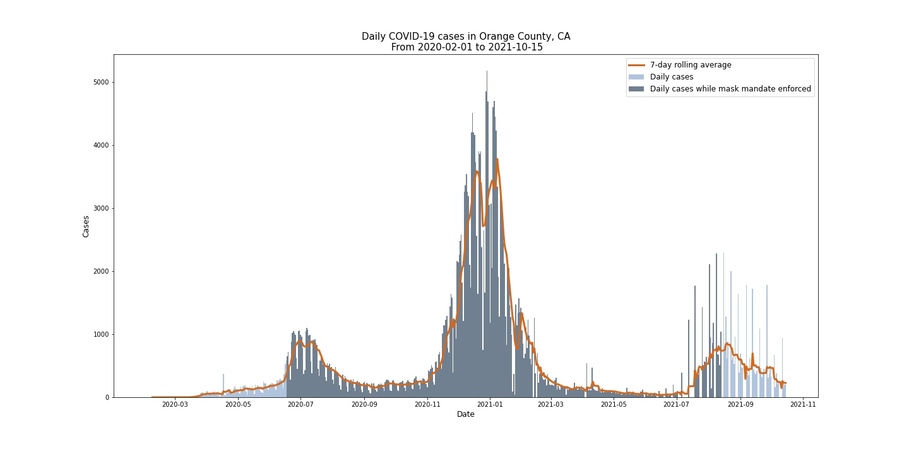
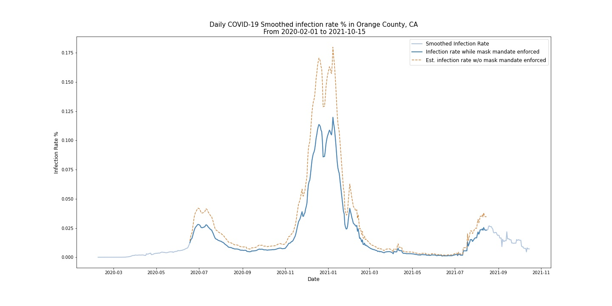

Anushna Prakash  
DATA 512 - Human-Centered Data Science  
November 4, 2021  
# 
 A4 - Common Analysis Reflection 

The visualizations for this assignment shows the daily new confirmed cases of COVID-19, the seven-day average of those daily cases, and the smoothed infection rate from the February 1, 2020 through October 15, 2021 during the COVID-19 pandemic. Those dates are in the x-axis of both figures. Though the axes labels continue forward into November 2021 for continuity, the data is intentionally truncated at October 15, 2021. The confirmed cases are represented in the y-axis in the representative unit in the top image, and the smoothed infection rate as a percentage is reported in the y-axis of the second image. The figures are reported from Johns Hopkins' University through a publicly-available data set on Kaggle.com.  

For the top image, the bar element of the figure shows the daily case count of COVID-19 in California's Orange County as extrapolated from the total cumulative case count figures as the bars of the plots. It is calculated by taking the difference in total cumultative cases from the total cumulative cases from the prior day. Each bar represents one day's data, so if a bar shows 20 for the case count, then that means that there were 20 new confirmed cases of COVID-19 on that day. There is typically a delay in between exposure to COVID-19, when symptoms show (if they show), and when individuals get a positive test result if they do indeed have COVID-19. Each bar is showing how many *positive test results* were processed that day, rather than how many individuals were *infected* with COVID-19 that day. When there is no prior day in the data available (e.g. the first day of available data), then the bar is blank. A second element of the bars is the shade. The darker-shaded bars indicate that the governing body of the county (either the county government itself or a higher government) imposed a mask mandate. This means that there was a requirement for individuals operating in a personal capacity to wear masks 1) anywhere outside their homes or 2) both in retail businesses and in restaurants/food establishments. This information comes a publicly available data set provided by the Center for Disease Control (CDC). Finally, the thicker orange line in the figure depicts the seven-day rolling average of daily confirmed cases by taking the average cases over the prior seven days (e.g. there is no average for the first seven days because there is insufficient data). A legend that labels the differences in these data series is located in the upper-right corner of the graph.  

For the second image, the line element of the figure shows the *smoothed* daily infection rate, calculated using the seven-day rolling average of daily confirmed cases to reduce noise from getting test results after weekends and holidays. The infection rate is calculated as $infection_rate = $

Second, we would like to understand what you got out of the collaborative activities in this assignment. You should write a reflection statement that highlights one or two specific things that you learned from answering the research question posed in this assignment. Your reflection statement should include specific attributions for any/all code, methods and techniques that you reused. Your reflection statement should be no more than 2 written pages.  