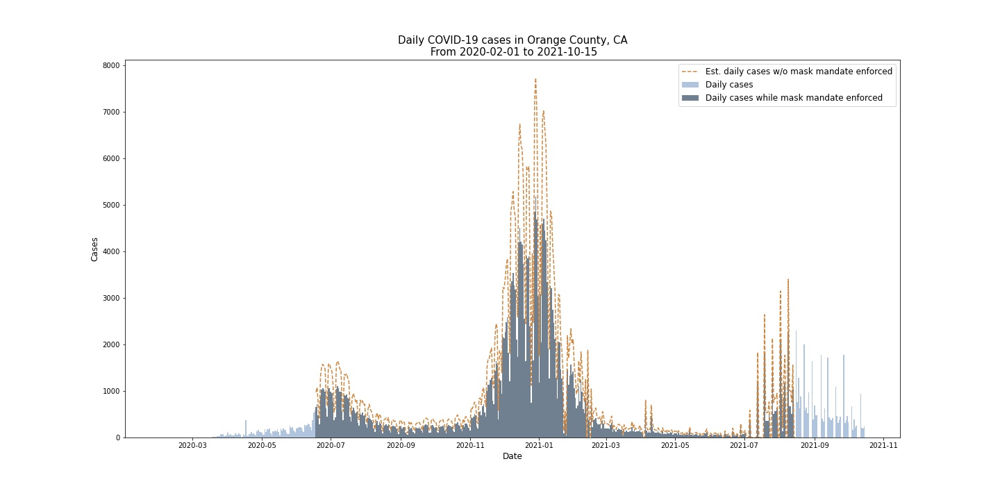

Anushna Prakash  
DATA 512 - Human-Centered Data Science  
November 4, 2021  
# 
 A4 - Common Analysis Reflection 

The visualization I created for this project is below.

Reflection here.  
First, for the visualization you created in Step 2, you should write up an explanation of the visualization. Some of the important things you might need to explain include:  
- What does the figure show?
- How does the viewer “read” the figure? What are the axes, and what do they represent?  
- What is the underlying data and how was it processed? You might think of this explanation as an extended figure caption.  
This explanation should be no more than 1 written page. Making a good effort now will make it easier to write your final report for Assignment A7.  

Second, we would like to understand what you got out of the collaborative activities in this assignment. You should write a reflection statement that highlights one or two specific things that you learned from answering the research question posed in this assignment. Your reflection statement should include specific attributions for any/all code, methods and techniques that you reused. Your reflection statement should be no more than 2 written pages.  